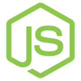

# Projeto: Movie List Data Base
O projeto consiste em website que trará uma lista de filmes, utilizando a api TheMovieDB

# Tecnologias Utilizadas
[](https://nodejs.org/en/)
[](https://www.browsersync.io/)
[](https://angularjs.org/)
[](http://gulpjs.com/)


# Instalando e executando a aplicação
Para instalação do ambiente de desenvolvimento será necessário executar os itens à seguir.


* ### NodeJS
  1. Baixar e instalar a ultima versão *LTS* o *NodeJS*, clicando [aqui](https://nodejs.org/en/download/). Caso você já possua o *NodeJS* instalado na máquina certifique-se que esteja fazendo uso da versão **4.4.2** ou **superior**.
  2. Após a instalação será necessário verificar se o *NodeJS* e o seu gerenciador de pacotes (NPM) foi instalado com sucesso, bem como os mesmo, estão presentes nas variáveis de ambiente do seu sistema operacional. Para isso execute o comando abaixo:

      ```javascript
      node -v && npm -v
      ```

* ### Inicializando a aplicação
   Após instalar o *NodeJS* com sucesso, será necessário baixar os fontes do projeto *Vamos Latam*. Com os fontes baixados no diretório de sua preferencia execute os passos à seguir:


   1. Primeiramente precisamos instalar as dependencias desse projeto, para isso execute o comando abaixo:

      ```javascript
      npm install
      ```

      Após a concluir o donwload das dependencias o gerenciador de pacotes irá executar automaticamente o comando de build da aplicação. Caso o processo tenha sido executado com sucesso uma pasta chamada **"build"**, será mostrada no diretório principal.


   2. Com as dependencias instaladas e o arquivos da aplicação gerados, iremos inicializar o servidor de desenvolvimento, para isso execute o comando abaixo:

      ```javascript
      npm start
      ```

      Depois de alguns segundos uma janela será aberta no browser com o projeto rodando.


    3. Deve-se alterar o valor do atributo href da tag <base> no index.html para ficar somente /. Essa alteração deve ser feita apenas localmente, não deve ser enviada para o server. Isso é necessário até que seja feita alguma modificação para o que o Browsersync consiga trabalhar com o contexto /vamos;

    
# Estrutura de diretórios
+ **build:** Esse diretório irá conter o projeto gerado e pronto para ser rodado em qualquer servidor web.
+ **configs:** Contém arquivos de configurações que são utilizadas durante o processo de desenvolvimento da aplicação, se ja pelo: automatizador de tarefas (*GulpJS*), servidor web (*Browsersync*), entre outros.
+ **doc:** Contém arquivos da documentação do sistema.
+ **node_modules:** Repositório de pacotes local do *NodeJS*.
+ **src:** Esse diretório contém os fontes da aplicação.
  + **src/app:** Esse diretório contém as definições de *módulos, directivas, controllers, services, etc*. Nesse diretório também estão os *templates* (*html*) da aplicação.
  + **src/assets:** Diretório onde serão incluídos os chamados *assets* da aplicação.

# Recomendações
+ ### Melhores práticas
  Para tornar os componentes reutilizáveis e minimizar o esforço em produções futuras, foi adotado e incorporado ao projeto o padrão de [Atomic Design](http://bradfrost.com/blog/post/atomic-web-design/).

+ ### IDE
  [](https://code.visualstudio.com/)
